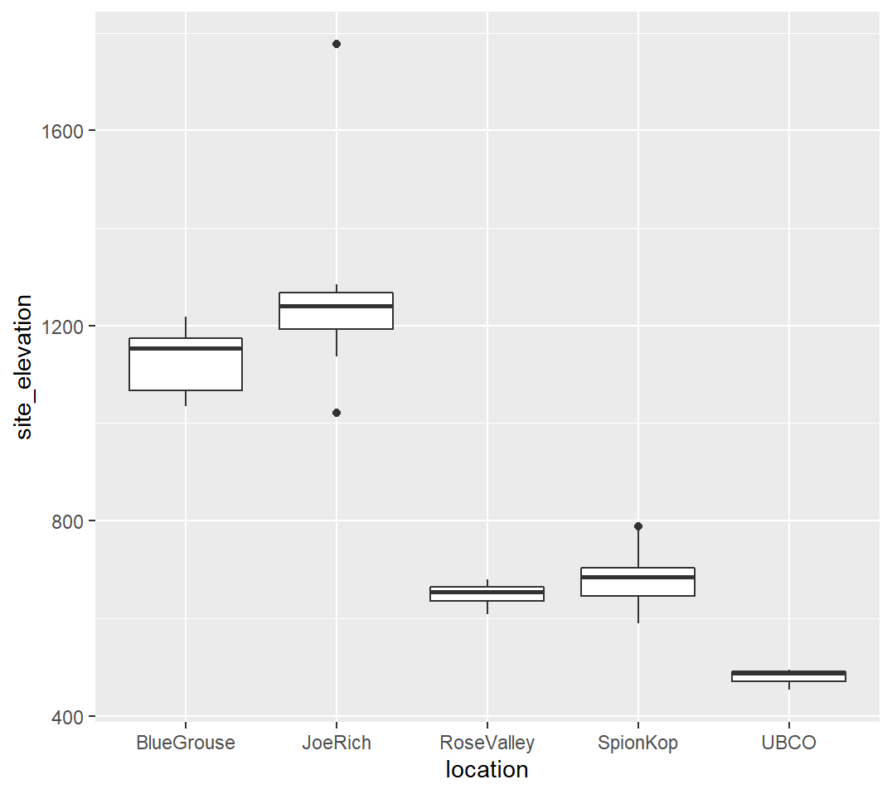

```{r setup, include=FALSE}
knitr::opts_chunk$set(echo = TRUE)

library(tidyverse)
library(palmerpenguins)
library(GGally)
library(kableExtra)
```

<!-- Title: Smart Forest - DRAFT -->

Ian Parfitt^1\*^

1.  University of British

\*Corresponding Author

\newpage

# Abstract

Forest fires are increasing in extent and intensity in Canada. The Smart Forest project will advance real-time fuel moisture estimation in the wildland-urban interface of the Central Okanagan region.

# Introduction

Climate change, land use, fire suppression and other land managment activities is increasing the intensity and extent of forest fires in Canada. The wildland-urban interface (WUI) is of particular concern as wildfires in the WUI have the potential to have catastrophic effects on communities and infrastructure. Fuel moisture indices are important for fire risk assessment and fire behaviour modelling during fire events. This project will investigate improvements in the spatial and temporal resolution of fuel moist indices in the Central Okanagan WUI.

# Methods

We are establishing automated weather stations that collect meteorological data (e.g. temperature, relative humidity, wind speed and direction, precipitation, and soil moisture) and transmit it every five minutes via the Rogers cellular network to databases at the University of BC - Okanagan in Kelowna. Several stations will be located at each of 5 locations that represent important dimensions of variation in the Central Okanagan WUI. We will also collect live and dead fuel samples at weather station locations and oven dry them in the lab to estimate moisture content. The fuel moisture data will be analysed as the dependent variable to the independent weather data using a stepwise regression method [@zhang_dynamic_2021].

# Discussion

The results of this study will be discussed here

# References

::: {#refs}
:::

# Tables

# Figure Captions

Figure 1. Elevations (in m) of the weather stations at each location.

# Figures



# Appendices
